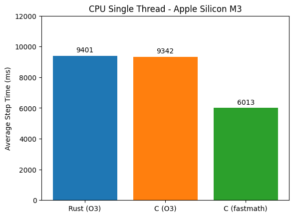
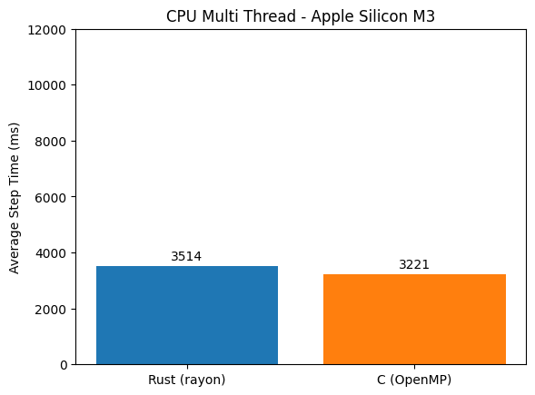
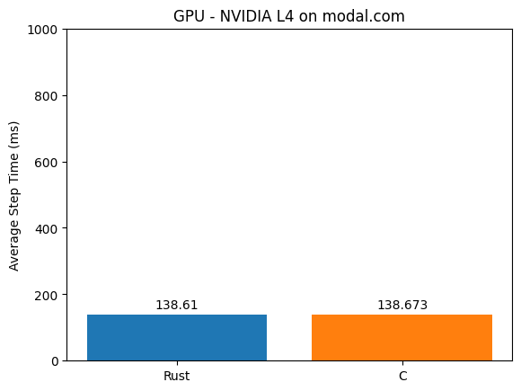

# llm.rs 🦀

A Rust port of Karpathy's [llm.c](https://github.com/karpathy/llm.c) - an LLM implementation focused on pretraining, and in particular reproducing the [GPT-2](https://github.com/openai/gpt-2) and [GPT-3](https://arxiv.org/abs/2005.14165) miniseries.

Rust is focused on performance and reliability, so I found it particularly interesting to see how these principles apply to an LLM training loop.

llm.rs is an educational project, in the spirit of llm.c but in Rust, where I tried to write code as **safe and idiomatic** as possible. The CPU and GPU paths remain close to the C/CUDA originals to ease learning and benchmarking. Training results are **bit-exact with the reference implementation**.

##  🔐 Rust Safety 

Rust enforces memory safety, thread safety, and data race prevention mostly at compile time, preserving runtime performance.

The CPU implementation [train_gpt2.rs](crates/llmrs/src/bin/train_gpt2.rs) is 100% safe Rust (no `unsafe` block).
 - A notable difference with C is the usage of sized arrays instead of pointers, preventing out-of-bounds access.
 - Shared buffers (parameters, activations, gradients) are split with `split_at_mut()` to satisfy the borrow checker and prevent aliasing (multiple mutable references to the same memory location).
  - Importantly, these checks have **minimal performance cost**, check the [performance section](#rust-vs-c-performances)

## ⚡️ CUDA with Rust

The CUDA implementation [train_gpt2_cuda.rs](crates/llmrs/src/bin/train_gpt2_cuda.rs) is using [cust](https://docs.rs/cust/latest/cust/), a light wrapper around the CUDA Driver API. This keeps the CUDA code from llm.c almost unchanged.

 - The kernel launchers are exposed in [cuda_launchers.rs](crates/llmrs/src/cuda_launchers.rs) where most `unsafe` blocks happen.
 - The CUDA kernels in (crates/llmrs/cuda) are still compiled with `nvcc`.
 - Rust manages GPU memory allocation with RAII cleanup.

## 📊 Rust vs C performances

### CPU Single Thread

- llm.c uses `-Ofast`, which enables *fast-math* (trading precision for speed).  
- **Rust does not yet provide a direct *fast-math*** equivalent.  
- For fair comparison, results are shown with both C and Rust compiled at `-O3`.  
- An additional C run with *fast-math* is included for reference.  




### CPU Multi Threading

- llm.c uses OpenMP for multithreading (minimal code changes).  
- In Rust, **the closest equivalent is [Rayon](https://docs.rs/rayon/latest/rayon/)**.
- Rayon is lightweight but requires more code changes, so a dedicated loop was added in [train_gpt2_rayon.rs](crates/llmrs/src/bin/train_gpt2_rayon.rs).



### GPU

The GPU kernels are the same in both implementations, so we expect minimal difference.

This chart shows the kernel run times, but to be honest I found that the overall loop was slower in Rust, this needs to be investigated.



## ⚙️ Getting started


### Prerequisites

- [Install Rust](https://www.rust-lang.org/tools/install)

```bash
curl --proto '=https' --tlsv1.2 -sSf https://sh.rustup.rs | sh
```

---

### With NVIDIA GPU

With an NVIDIA GPU and CUDA installed, you can build directly with CUDA + BF16 support:

```bash
cargo build --release --features cuda,bf16
```

Download the training datasets:

```bash
sh ./dev/download_starter_pack.sh
```

Run CUDA training:

```bash
cargo run --release --features cuda,bf16 --bin train_gpt2_cuda
```

---

### Without NVIDIA GPU (Mac & others)

Fortunately it is also possible to develop without an NVIDIA GPU on your local computer. This is what I need with devcontainer and modal.com.

With devcontainer, part of your IDE is running inside a container. This project ships with a `devcontainer.json` that pulls a CUDA enabled image + Rust. Thus you can make the IDE linting work as expected and build the project locally.

To use it in Cursor for instance:
`Cmd + Shift + P` → **Dev Container: Rebuild and Reopen in Container**.
This opens a new Cursor window on the project in which you can develop as usual and build.

Then to actually run CUDA training or tests with CUDA, you will need a GPU. One option is [modal.com](https://modal.com/docs/guide#getting-started):

1. Create a Modal account.  
2. Install Python package:  
   ```bash
   pip install modal
   ```  
3. Authenticate:  
   ```bash
   modal setup
   # or: python -m modal setup
   ```

Run CUDA training on Modal:

```bash
modal run run_on_modal.py --command "cargo run --features cuda,bf16 --release --bin train_gpt2_cuda"
```

The [run_on_modal.py](run_on_modal.py) script defaults to an NVIDIA L4 instance.

## 📝 Todo

- [ ] Measure the complete GPU training loop timings. Rust should not be slower - FFI call overhead is too low for that.
- [ ] Automate the bit-exact comparison with the reference implementation in CI
- [ ] Improve Rust idiomatic style — I’m sure this can still be refined.

## license

MIT
